# TDD/Active-learning Infra Pattern

## Use Case

## Architecture

## Diagram

[comment]: <> (![diagram]&#40;diagram.png&#41;)

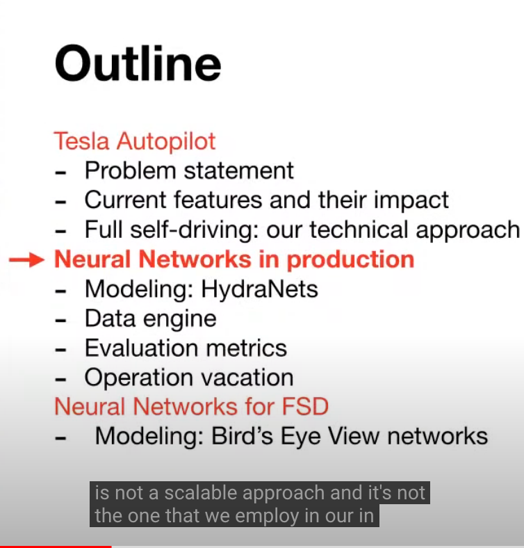
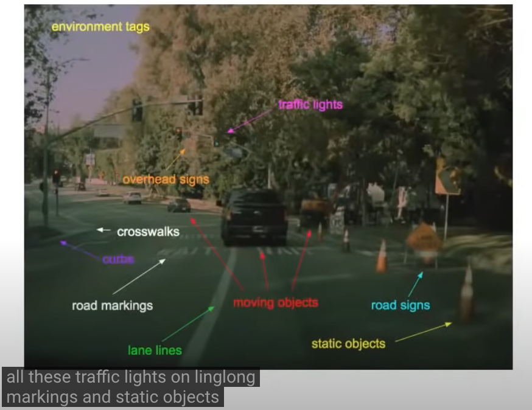

many networks responsible for different tasks

2 "customers" for these predictions:

1. planning and control module: to wind its way around all of these components
2. instrument cluster: for customers (observability) to give them some confidence that
   autopilot is functioning correctly
    - note: MANY predictions not served to during in-house data visualization (e.g.,
      line markings or other "attributes") and even fewer served to customers.

Prediction Difficulties: ex. stop sign

1. occluded:

- by foliage (partial)
- objects (fractional)

2. part of structure

- parking lot entry/exit arm
- school bus (disabled or enabled state)

3. constraint-conditioned

- "except right turn"
  etc. ...

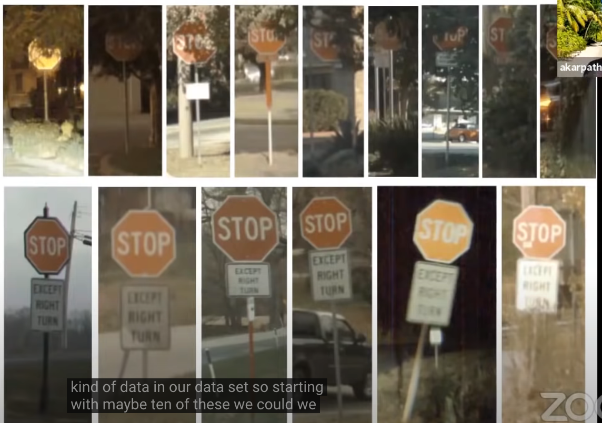
Filter useful predictions via active learning:

- Bootstrap classifier with seed dataset (e.g., foliage-occluded stop sign detection
  <=> 10 foliage-occluded images)
- Deploy classifier to fleet, positive predictions trigger data and telemetry
  collection, sending images to Tesla for downstream application training data

=> Very useful BUT heavy project

- since product is in hands of customers, you MUST go through the long tail; can't just
  do 95% and call it a day. => interesting challenges
- e.g., now how do we get "stop sign feature" to work globally? i.e., to handle
  international case?:

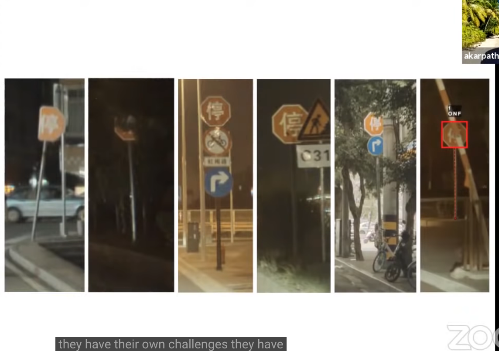
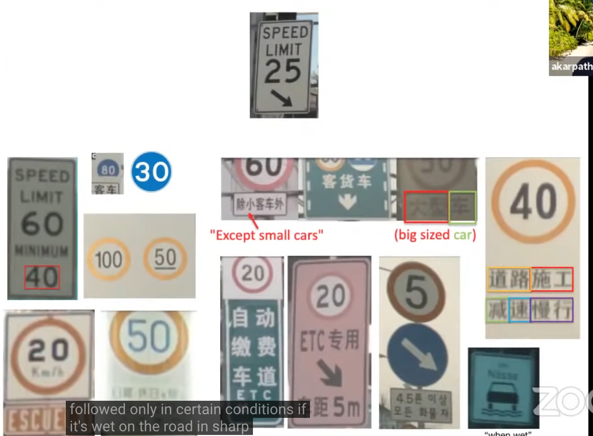

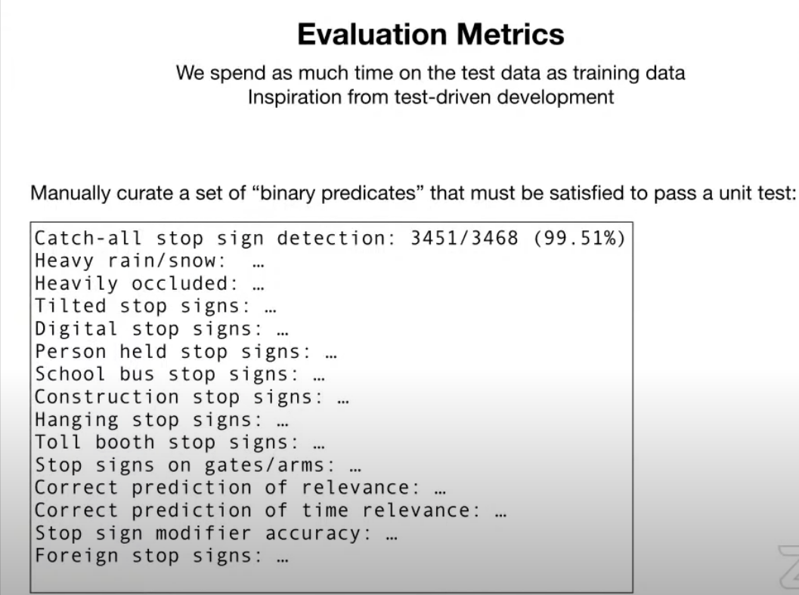

### ML-testing CENTRAL to Process

Test sets curation JUST AS OR MORE IMPORTANT as train set curation;

- you can do arbitrary things on the training set
- BUT YOU MUST HAVE A REALLY GOOD EVALUATION ON THE TEST SET SINCE THAT GATES YOUR
  RELEASE INTO THE WORLD => Unit Tests for predictions to prevent ANY regressions;
  system STRICTLY improves over time

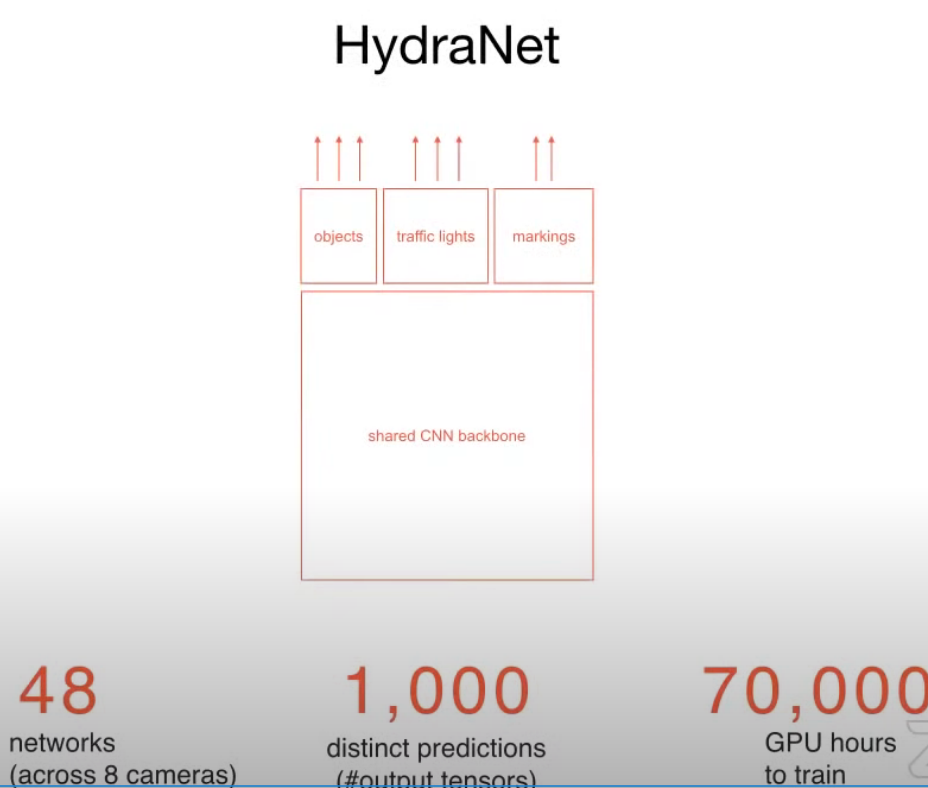
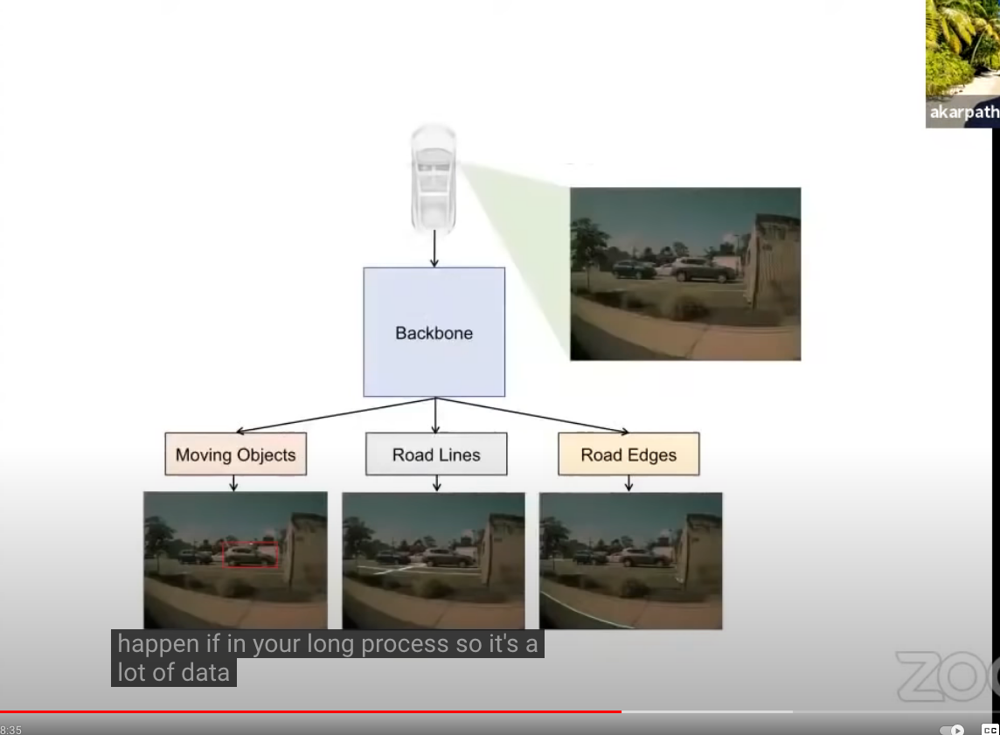

### MULTI-TASK LEARNING!!

Hand-in-hand with general computer vision infra/ general image recognition system / ML
model development platform (see next section), leverage general shared architecture
topology across models!

note: can get away with some fine-tuning; training this network from scratch would take
a long time.

=> implication: design system for maximum continuous retraining compatibility?

- e.g., NO batch norm to avoid introducing iid assumption which is assuredly going to be
  violated in production? (which also avoids insidious prediction bugs by same
  reasoning)

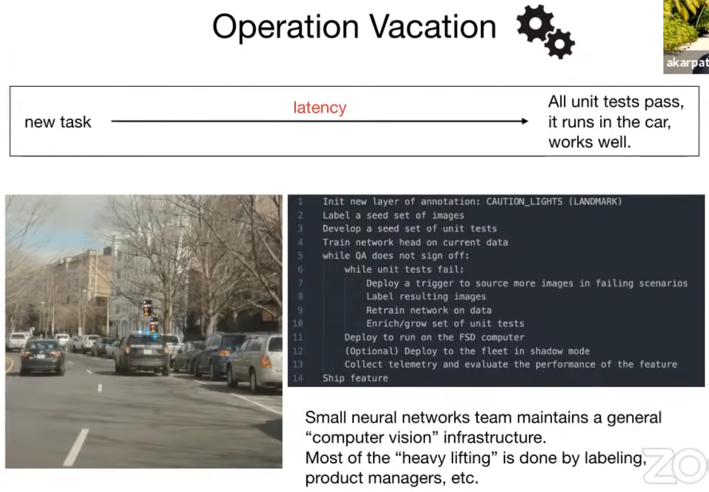

### Scaling ML Impact (NOT team size)

How do you make this work across very small teams? (i.e., a few dozen engineers @ Tesla)

=> Structure **everything** around core infrastructure, providing "meta-layer" to
operate at.

- i.e., general computer vision infrastructure / general image recognition system in
  which it is very easy to:
    - curate datasets
    - create new types of tasks that fall into certain buckets, e.g., new:
        - landmark task
        - segmentation task
        - detection task
        - add/change attributes around
        - etc.
    - Note!: Hand-in-hand with multi-task shared architecture topology across models!

=> NN team focuses on high-value task of building CV infrastructure, have labeling team,
PM team, etc., use infrastructure to do heavy lifting

- e.g. 1M types of speed limits,
    - DON'T want NN engineers spending time on that vs. other higher-value general infra
      development.
    - someone else can collect all these datasets to make it work

=> very tractable. can indeed create generic computer vision systems that people can use
to develop all these features and then deploy them on the car.

==> very important:

1. automation!
2. new feature deployment latency (minimize)

=> think of ourselves mainly as developing core infra NOT pursuing individual tasks (
e.g., "stop sign detection")

Neural Network Engineers concerned with prototypes

- segmentation
- detection and
- active learning infrastructure, bubbling up these datasets from the fleet.

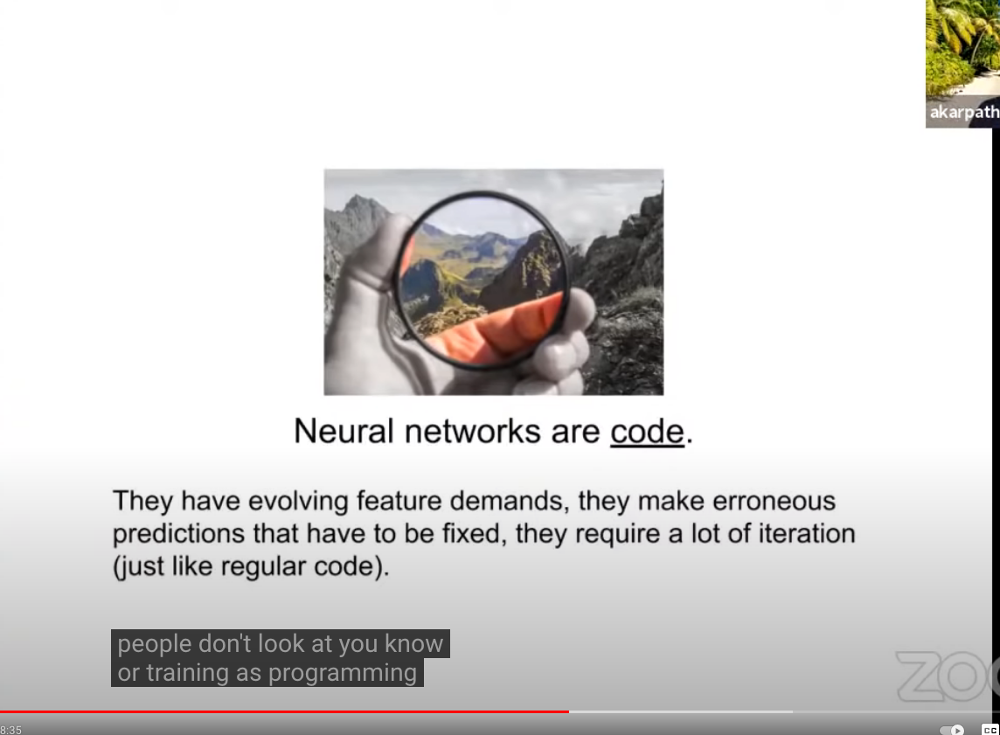

### Neural network training IS programming!

- feature demands
- fix errors
- PRs
- etc. => borrow a lot of concepts

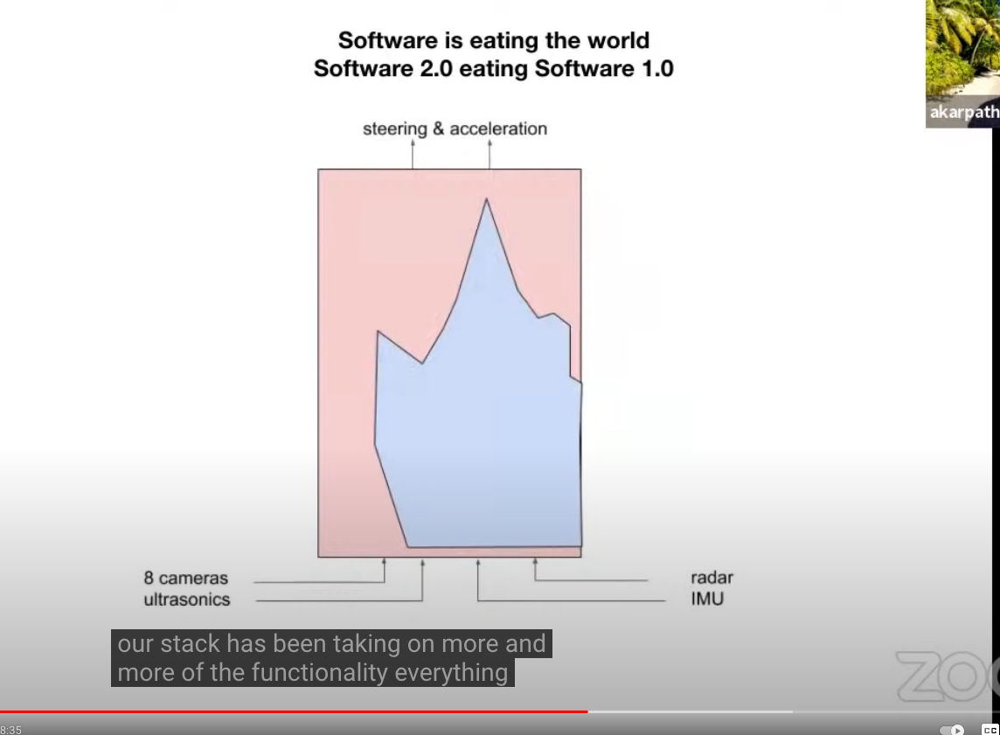

### Software 2.0 from 1.0 strangler pattern

End-to-end system BETTER than ensemble of task-specific heuristics and predictors =>
Transition system to be more and more end-to-end

ex. not many segmentation models @ Tesla

- segmentation on pixels looks good on image
- but need to project out and make 3D sense of it, otherwise you can't drive through
  it <= hard part
    - e.g. detecting lane line markings individually and stitching them up is HIGHLY
      error-prone
    - => predicting out of the network directly works much better!

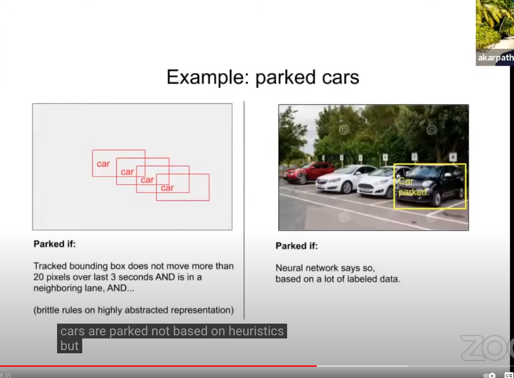
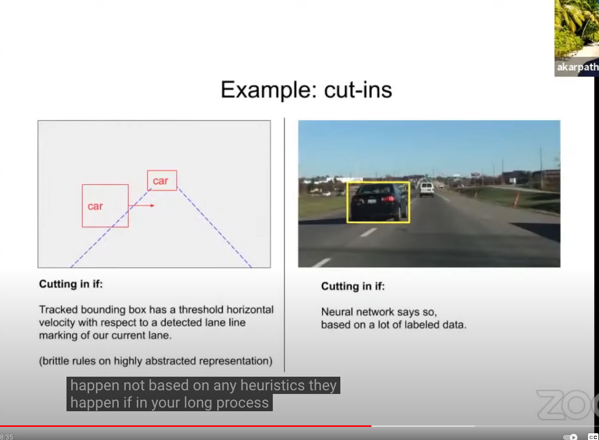

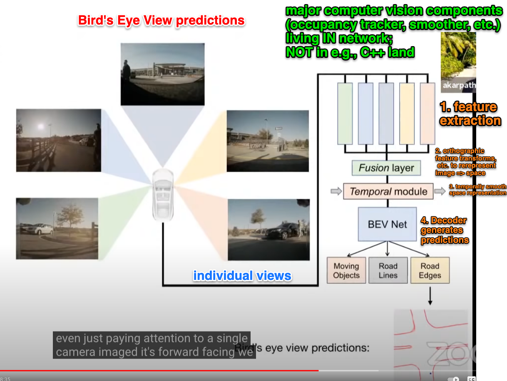
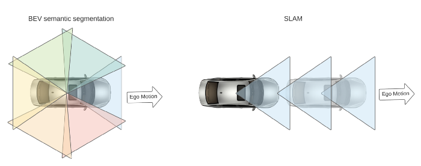
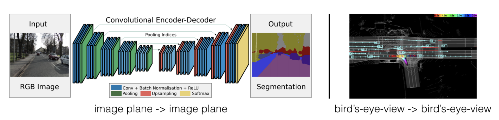

> ❓ All you need is (multimodal) datasets
>
> The recent release of many multi-modality datasets (Lyft, Nuscenes, Argoverse, etc)
> makes direct supervision of the monocular BEV semantic segmentation task possible.
> These datasets provide not only 3D object detection information but also an HD map 
> along with localization information to pinpoint the ego-vehicle at each timestamp on 
> the HD map. 
> 
> The BEV segmentation task has two parts the (dynamic) object segmentation task, 
> and the (static) road layout segmentation task. For object segmentation, 3D 
> bounding boxes are rasterized into the BEV image to generate annotation. For 
> static road layouts, maps are transformed into the ego vehicle frame based on 
> provided localization results and rasterized into BEV annotation.

## Pros

## Cons

## Considerations

## Sample

